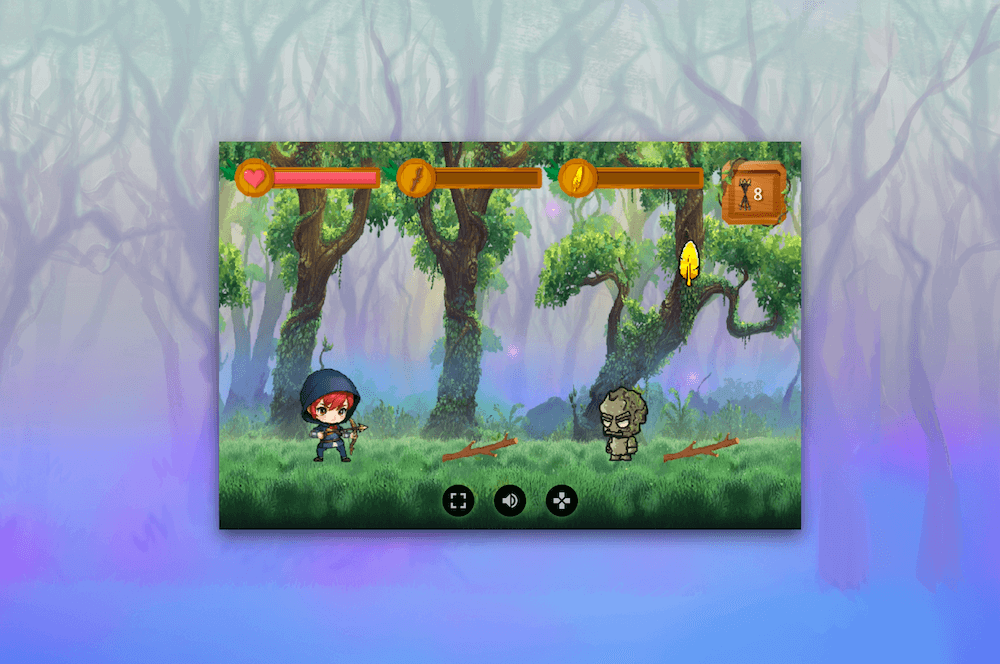

# NARA - Guardian of the Greenwood

**NARA - Guardian of the Greenwood** is a 2d jump and run browser game built with vanilla JavaScript. Try it 👉 [**here**](https://nara-game.natgian.com)

## Purpose

This game was created to practice OOP (object oriented programming). The goal was to provide a fun and interactive experience directly in the browser, without any external frameworks.

## Features

- **Character movement:** The character can move left and right and jump
- **Background layers:** The background has multiple layers including flying objects to make it more dynamic
- **Collision detection:** The character can collide with enemies and also collect items
- **Crafting:** When the character has collected enough items it can craft new arrows
- **Input controls:** The player can use the keyboard to play, for tablets and mobile devices the inputs are connected to buttons
- **Sound effects and background music:** The game has a background music and every interaction has sound effects, the sound can be muted
- **Restart functionality:** Once the game is over the player can restart it or go back to the menu
- **Responsiveness:** Works across desktop, tablet, and mobile devices

## Technologies Used

- HTML5 for canvas rendering, start and ending screens
- JavaScript for game logic
- CSS3 for styling

## Installation

To get a local copy of the project up and running, follow these steps:

1. clone the repository
2. open the `index.html` file in your browser

## Contact

For questions or feedback, please contact:

- Email: <info@natgian.com>
- GitHub: [natgian](https://github.com/natgian)
